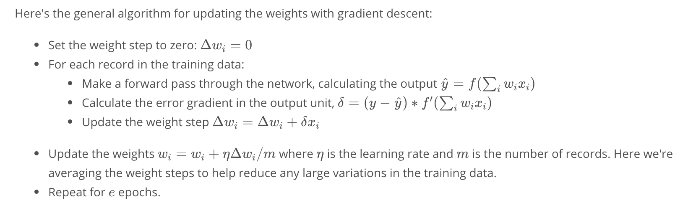

In this module, we cover deep neural networks.  By the end of the project, we will train a DNN to drive a car in a simulator.  
This will be done by manually driving the car in the simulation to develop a training set; the DNN will then learn from the way you drive!

## Linear and Logistic Regression
Lesson starts by with classic housing prices example, showing why linear regression is useful, but also 
how a linear regression is optimized by reducing the residual error, e.g., by using the method of least 
squares (minimizing the sum of squared errors). 

This is where gradient descent is introduced: how exactly do you reduce the sum of squared errors?

Describing a linear relationship by a best fit line is not always applicable: what if your target variable
only takes on values in a binary set, e.g., {0,1} or {cat, notCat}?  This is where logistic regression
is introduced...

There are a lot of ways to paint logistic regression. A simple way is to consider it like linear regression
with a different error function to minimize.

Problem: a logistic regression computes a linear decision boundary; what if that doesn't work?

Enter neural networks.


Instead of figuring out one linear decision boundary, we now figure out two.
```
# Perceptrons
 |--> h1=step(<m,x>+b) --
x                        |--> y=step(ph+d)
 |--> h2=step(<n,x>+c) --
```

At first, the network does not know which lines will best partition the data, so we initialize
the weights m, n, p, and biases b, c, d randomly.  One can then compute the error in y based on actual observations,
and use gradient descent to modify the weights little by little until the error is minimized.
The trained weights represent a set of decisions that the networks has found to be most applicable
in properly answering the binary classification.

Neural networks are natural feature selectors in that a near-zero valued weight on a given input feature
at a given perceptron/node implies that the input feature is not important for the corresponding decision.
If the weights on that input are near-zero for all perceptrons/nodes in the post-input layer, then the network
has effectively realized that the feature is pretty useless in terms of the necessary decision making. 
(Note that these comments are assuming all features have been normalized; otherwise, very small or very
large weights do not necessarily measure feature importance, but how much rescaling is necessary to 
make the feature effective.)

## Building a Perceptron Network by Hand
```
# For all logic perceptrons below, x in {(0,0), (0,1), (1,0), (1,1)}
# AND Perceptron
    x --> step(x[1]+x[2]-1.1) --> {0|1}
# OR Perceptron
    x --> step(x[1]+x[2]-0.9) --> {0|1}
# NOT Perceptron (acts on 2nd component only)
    x --> step(-x[2]+1) --> {0|1}
# XOR Perceptron Network
## Might be a little crazy to write out here... 
## Just know that following the input layer, there is a 4-perceptron hidden layer, 
##    followed by a 2-perceptron hidden layer, followed by the OR gate output layer
```

## Neural Networks: C'mon, don't build them by hand!
The above logic networks were built by hand -- that is, we specified the weights 
that would mimic the function we were approximating.  In general, a neural network 
approximates a function by learning how to approximate the function.  That is, 
we do not specify the weights in a neural network because, in general, we do not
know anything about the function that is being approximated (aside from its input
and output, in the supervised case).  So, instead, a neural network is born into
the world with a bunch of nonsensical ideas (weights) on how to synthesize and understand
its observations.  However, it can learn.  Each time the net thinks it has better
figured the world out, it compares its predictions to actual observations/results, 
and notes what about its assumptions are causing any discrepancy between the two
so that it can correct for it.  This process is called gradient descent and is typically
computed via backpropagation.  Although I anthropromorphized the hell out of it, it is
is pretty basic math. 

1. "Am I wrong?"
 - i.e., choose an error function to compare outputs, y[i,j], with predictions, p[i,j], where the i indicates the data point, and j indicates which output node (if only one output node, then the notation simplifies to y[i] and p[i])
 - SSE = S[i]S[j](y[i,j] - p[i,j])^2, where the sum over i is over data points, and the sum over j is over output nodes (if there is only one output node, like in a binary classification, then this eq'n reduces to SSE = S[i](y[i]-p[i])^2)
2. "Where did I go wrong?"
 - weights in a neural network are like assumptions that help in the decision making process
 - the prediction (or "output decision") made by the network is a function of these assumptions
 - to figure out how each assumption/weight contributed to the output error, we look at the gradient of the error function w.r.t. the weights, which points in the direction in weight/bias space that will most rapidly increase the error --- we want to go in the exact opposite direction!
 - knowing the error and the gradient, we can then estimate how much to change each weight/assumption so that the network can make better "output decisions" the next time around
 
 
 http://ruder.io/optimizing-gradient-descent/index.html

## Data Prep
### Feature Standardization / Normalization
Do you know why it's important to somehow standardize or normalize your inputs to a neural network?

One reason is that activation functions, like sigmoid or tanh, generally squash large numbers.  If all the
numbers passing through an activation are large, learning will become difficult because they will all look
the same post-activation unless you carefully plan out the appropriate scale to initialize your
weights for each new project.  By standardizing the inputs (zero mean and unit deviation), we no longer have to
worry about this: weights can be initialized similarly each time and the activation functions will not
serve as learning handicaps.

### MSE vs SSE
This is another thing that did not occur to me previously: though one might think MSE and SSE are nearly identical as loss
functions, in practice MSE is the better choice.  Why?

When using a lot of data, the SSE can become arbitrarily large.  In theory, whatever.  In practice, this 
means you need to very carefully plan out your learning rate, lest the gradient descent diverges due to
oversized updates.  MSE offers convenience: by putting large and small data sets on the same footing, we 
are able to apply the the same rule-of-thumb for choosing an initial learning rate -- usually 0.01-0.001.

### Lingo
A lot of ML lingo in general have synonyms in all the other data fields, like digital signal processing, statistical analysis, etc.
The same is true for neural network lingo.

Remember, a linear regression model can be thought of as a simple neural network.  In linear regression, you don't often
hear about doing a forward pass through the network, then a backward pass.  But you hear that all the time when talking about
NNs.  Well, a doing a forward pass just means "compute the model output." The subsequent backward pass just means "update the model weights."  

### Passing Through the Net: Batch Size
When you do a full forward/backward pass, you can do it with all the data.   Or, you can do it a single data point at a time.
Actually, the options do not stop there: you can do a foward/backward pass with any batch size.  

Using a single data point makes it so the updates are overly reliant on a single data point.  Using the entire data
set can simply take forever if the data set is huge.  Worse, each long-time-to-compute update is just one estimate of
what the update should actually be.  By choosing to go with a "mini batch" of data (instead of the full batch), 
you can benefit from quicker update times and many more update estimates.  

If you think about it, this can be made to be like bootstrapping.  Instead of updating updating after each
mini-batch pass, you can choose the average of the past 5 mini-batch updates or the average of 5 concurrent 
mini-batch updates.  This type of mechanism allows you to get a more robust estimate of what the update should 
be at each update step.  (I think this is likely how the momentum mechanism works.)


## Updating weights w/ Gradient Descent


```python
import numpy as np
from data_prep import features, targets, features_test, targets_test


def sigmoid(x):
    """
    Calculate sigmoid
    """
    return 1 / (1 + np.exp(-x))

# Use to same seed to make debugging easier
np.random.seed(42)

n_records, n_features = features.shape
last_loss = None

# Initialize weights
weights = np.random.normal(scale=1 / n_features**.5, size=n_features)

# Neural Network hyperparameters
epochs = 1000
learnrate = 0.5

for e in range(epochs):
    del_w = np.zeros(weights.shape)
    for x, y in zip(features.values, targets):
        # Loop through all records, x is the input, y is the target

        # TODO: Calculate the output
        output = sigmoid(np.dot(x, weights))

        # TODO: Calculate the error
        error = (y - output)*output*(1-output)

        # TODO: Calculate change in weights
        del_w += error*x

        # TODO: Update weights
    weights += learnrate*del_w/len(targets)

    # Printing out the mean square error on the training set
    if e % (epochs / 10) == 0:
        out = sigmoid(np.dot(features, weights))
        loss = np.mean((out - targets) ** 2)
        if last_loss and last_loss < loss:
            print("Train loss: ", loss, "  WARNING - Loss Increasing")
        else:
            print("Train loss: ", loss)
        last_loss = loss


# Calculate accuracy on test data
tes_out = sigmoid(np.dot(features_test, weights))
predictions = tes_out > 0.5
accuracy = np.mean(predictions == targets_test)
print("Prediction accuracy: {:.3f}".format(accuracy))
```

## Multi-Layer Perceptron Math
* The input is transferred to the hidden layer: 
  - x[i]w[i,j] = h[j]  (using Einstein summation convention)
  - note that x and y are row vectors
  - w[i,j]: the matrix w transfers input i to hidden unit j
  - that is, w[i,j] maps ith component of input vector to jth component of hidden vector
  - note that the above notation suppresses the data point index, i.e., we could more specifically write:  
    * x[i,p]w[i,j] = h[j,p]
* Get past the hidden layer w/ another transfer matrix
  - A(h[j])v[j,k] = logit[k]
  - v[j,k] maps the jth component of the activated hidden vector, A(h[j]), to the kth component of the pre-output (sometimes called logit)
* All together now:
  - B(A(x[i]w[i,j])v[j,k]) = y[k]
  - A and B are activation functions, e.g., A = relu, B = sigmoid
  - if not suppressing the data point index, it looks like this:
    * B(A(x[i,p]w[i,j])v[j,k]) = y[k,p]

Technically, a bias/offset term is added to each transfer matrix before an activation is applied.
Oftentimes, the notation above is employed w/ the bias term implied.  Here is the more explicit
version of the equation:

y[k] = B(A(x[i]w[i,j]+b[j])v[j,k]+c[k])

The input is linearly transformed and activated, the result of which is then linearly transformed and activated to give the output.

Note that we use row vectors in this course, but in other places people use column vectors.  This will change the look of the equation.

y[k] = B(v[k,j]A(w[j,i]x[i]+b[j])+c[k])   <-- col vec representation

By default, NumPy arrays are row-like, thought you can make 'em col-like:  
* row = vec
* col = vec[:,None]

```python
import numpy as np

def sigmoid(x):
    """
    Calculate sigmoid
    """
    return 1/(1+np.exp(-x))

# Network size
N_input = 4
N_hidden = 3
N_output = 2

np.random.seed(42)
# Make some fake data
X = np.random.randn(4)

weights_input_to_hidden = np.random.normal(0, scale=0.1, size=(N_input, N_hidden))
weights_hidden_to_output = np.random.normal(0, scale=0.1, size=(N_hidden, N_output))


# TODO: Make a forward pass through the network

hidden_layer_in = np.dot(X, weights_input_to_hidden)
hidden_layer_out = sigmoid(hidden_layer_in)

print('Hidden-layer Output:')
print(hidden_layer_out)

output_layer_in = np.dot(hidden_layer_out, weights_hidden_to_output)
output_layer_out = sigmoid(output_layer_in)

print('Output-layer Output:')
print(output_layer_out)
```
 
