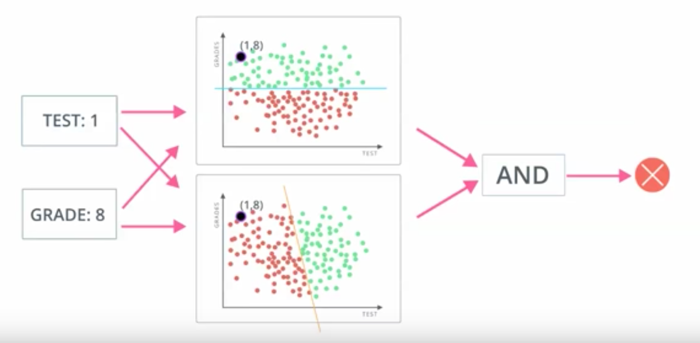

In this module, we cover deep neural networks.  By the end of the project, we will train a DNN to drive a car in a simulator.  
This will be done by manually driving the car in the simulation to develop a training set; the DNN will then learn from the way you drive!

## Linear and Logistic Regression
Lesson starts by with classic housing prices example, showing why linear regression is useful, but also 
how a linear regression is optimized by reducing the residual error, e.g., by using the method of least 
squares (minimizing the sum of squared errors). 

This is where gradient descent is introduced: how exactly do you reduce the sum of squared errors?

Describing a linear relationship by a best fit line is not always applicable: what if your target variable
only takes on values in a binary set, e.g., {0,1} or {cat, notCat}?  This is where logistic regression
is introduced...

There are a lot of ways to paint logistic regression. A simple way is to consider it like linear regression
with a different error function to minimize.

Problem: a logistic regression computes a linear decision boundary; what if that doesn't work?

Enter neural networks.



Instead of figuring out one linear decision boundary, we now figure out two.
```
# Perceptrons
 |--> h1=step(<m,x>+b) --
x                        |--> y=step(ph+d)
 |--> h2=step(<n,x>+c) --
```

At first, the network does not know which lines will best partition the data, so we initialize
the weights m, n, p, and biases b, c, d randomly.  One can then compute the error in y based on actual observations,
and use gradient descent to modify the weights little by little until the error is minimized.
The trained weights represent a set of decisions that the networks has found to be most applicable
in properly answering the binary classification.

Neural networks are natural feature selectors in that a near-zero valued weight on a given input feature
at a given perceptron/node implies that the input feature is not important for the corresponding decision.
If the weights on that input are near-zero for all perceptrons/nodes in the post-input layer, then the network
has effectively realized that the feature is pretty useless in terms of the necessary decision making. 
(Note that these comments are assuming all features have been normalized; otherwise, very small or very
large weights do not necessarily measure feature importance, but how much rescaling is necessary to 
make the feature effective.)


