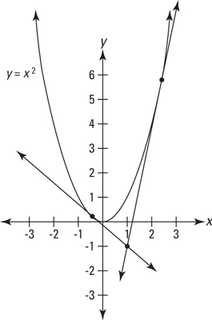
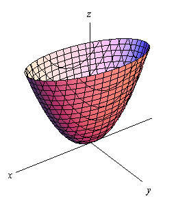
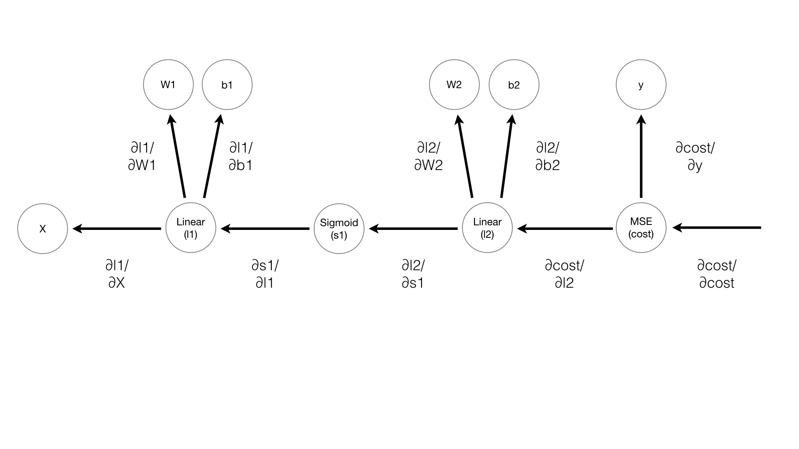

# MiniFlow
The objective of this lesson is to create a "mini version" of TensorFlow.  The reason for this exercise is to help students 
better understand backpropagation and differentiable graphs so that we can appreciate how TensorFlow works under the hood.

## Graph Representations of Neural Networks
How NNs are represented has definitely confused me from time to time.  This is in part due to the fact that
they aren't always pictorialized the same.

For example, there is this type of representation:


In this picture, one representation is to put unlearnable components at the nodes (the input,
the nonlinear activation, and the output) and have the network parameters/weights defined
along the edges.  However, one might also interpret the hidden layer node as the linear-nonlinear
composition, and all edges having unit weight.

The latter representation is a little closer to how we will represent MiniFlow.
In MiniFlow, edges are unital, and each node is a mathematical operation.


```python
"""
You need to change the Add() class below.
"""

class Node(object):
    def __init__(self, inbound_nodes=[]):
        # Nodes from which this Node receives values
        self.inbound_nodes = inbound_nodes
        # Nodes to which this Node passes values
        self.outbound_nodes = []
        # A calculated value
        self.value = None
        # Add this node as an outbound node on its inputs.
        for n in self.inbound_nodes:
            n.outbound_nodes.append(self)

    # These will be implemented in a subclass.
    def forward(self):
        """
        Forward propagation.

        Compute the output value based on `inbound_nodes` and
        store the result in self.value.
        """
        raise NotImplemented


class Input(Node):
    def __init__(self):
        # an Input node has no inbound nodes,
        # so no need to pass anything to the Node instantiator
        Node.__init__(self)

    # NOTE: Input node is the only node that may
    # receive its value as an argument to forward().
    #
    # All other node implementations should calculate their
    # values from the value of previous nodes, using
    # self.inbound_nodes
    #
    # Example:
    # val0 = self.inbound_nodes[0].value
    def forward(self, value=None):
        if value is not None:
            self.value = value


#class Add(Node):
#    def __init__(self, x, y):
#        # You could access `x` and `y` in forward with
#        # self.inbound_nodes[0] (`x`) and self.inbound_nodes[1] (`y`)
#        Node.__init__(self, [x, y])
#    def forward(self):
#        x=self.inbound_nodes[0].value
#        y=self.inbound_nodes[1].value
#        self.value = x+y

class Add(Node):
    def __init__(self, *inputs):
        Node.__init__(self, inputs)

    def forward(self):
        self.value=0
        for node in self.inbound_nodes:
            self.value +=node.value

class Mul(Node):
    # You may need to change this...
    def __init__(self, *inputs):
        Node.__init__(self, inputs)

    def forward(self):
        self.value=1
        for node in self.inbound_nodes:
            self.value *= node.value
    
    
class Linear(Node):
    def __init__(self, inputs, weights, bias):
        Node.__init__(self, [inputs, weights, bias])

        # NOTE: The weights and bias properties here are not
        # numbers, but rather references to other nodes.
        # The weight and bias values are stored within the
        # respective nodes.

    def forward(self):
        """
        Set self.value to the value of the linear function output.

        Your code goes here!
        """
        x = self.inbound_nodes[0].value
        w = self.inbound_nodes[1].value
        b = self.inbound_nodes[2].value
        #self.value = b
        #for xx,ww in zip(x,w):
        #    self.value += xx*ww
        self.value = np.dot(x,w) + b

"""
No need to change anything below here!
"""
def topological_sort(feed_dict):
    """
    Sort generic nodes in topological order using Kahn's Algorithm.
    `feed_dict`: A dictionary where the key is a `Input` node and the value is the respective value feed to that node.
    Returns a list of sorted nodes.
    """
    input_nodes = [n for n in feed_dict.keys()]
    G = {}
    nodes = [n for n in input_nodes]
    while len(nodes) > 0:
        n = nodes.pop(0)
        if n not in G:
            G[n] = {'in': set(), 'out': set()}
        for m in n.outbound_nodes:
            if m not in G:
                G[m] = {'in': set(), 'out': set()}
            G[n]['out'].add(m)
            G[m]['in'].add(n)
            nodes.append(m)
    L = []
    S = set(input_nodes)
    while len(S) > 0:
        n = S.pop()
        if isinstance(n, Input):
            n.value = feed_dict[n]
        L.append(n)
        for m in n.outbound_nodes:
            G[n]['out'].remove(m)
            G[m]['in'].remove(n)
            # if no other incoming edges add to S
            if len(G[m]['in']) == 0:
                S.add(m)
    return L


def forward_pass(output_node, sorted_nodes):
    """
    Performs a forward pass through a list of sorted nodes.
    Arguments:
        `output_node`: A node in the graph, should be the output node (have no outgoing edges).
        `sorted_nodes`: A topologically sorted list of nodes.
    Returns the output Node's value
    """
    for n in sorted_nodes:
        n.forward()
    return output_node.value
```

Play w/ MiniFlow
```python
from miniflow import *

x, y, z = Input(), Input(), Input()

f = Add(x, y, z)

feed_dict = {x: 4, y: 5, z: 10}

graph = topological_sort(feed_dict)
output = forward_pass(f, graph)
```


## Activation Functions: Why do we need them?
What we need is the capacity to model nonlinearities, which the activation functions provide.
The linear transform operations cannot, by definition, model nonlinearities in the input. A sequence
of linear transforms is still just a linear transform.  However, once we separate each linear 
transform by nonlinear activation functions, learning weights no longer reduces to learning the
best effective linear transform, but learning the best linear transform arguments to nonlinear functions.

Learning the best linear transform arguments to activation functions is another way of saying that
we are learning which features from the previous layer are important to the
decision that must be made at each node in the current layer.  

A dead node is one which outputs near zero for all data points.  Effectively, it is a node that
has to make a decision that never matters to the problem at hand...  The answer is always no.
A saturated node is one which outputs near one for all data points... Effectively, it is a node that
has to make a decision that never matters to the problem at hand...  The answer is always yes.
Both these cases are undesirable in practice and result from not being able to effectively handle
backpropagation, etc.

### Add Sigmoid Node to MiniFlow
```python
class Sigmoid(Node):
    def __init__(self, node):
        Node.__init__(self, [node])
        
    def _sigmoid(self, x):
         return 1. / (1+np.exp(-x))   
        
    def forward(self):
        """
        Perform the sigmoid function and set the value.
        """
        input_value = self.inbound_nodes[0].value
        self.value = self._sigmoid(input_value)
```


## Cost Function
The cost function is a function of the network parameters -- the weights and biases.  It measures how
close the network output approximates the true output function.  A smaller cost is a better network!

The cost function is often synonymous w/ loss function.  Both names make sense:
* cost measures how much accuracy it has cost us to use the network instead of the true, likely unknown function
* loss measures how much info is lost when using the network versus the true, likely unknown function

### Add MSE node to MiniFlow
```python
class MSE(Node):
    def __init__(self, y, a):
        """
        The mean squared error cost function.
        Should be used as the last node for a network.
        """
        # Call the base class' constructor.
        Node.__init__(self, [y, a])

    def forward(self):
        """
        Calculates the mean squared error.
        """
        # NOTE: We reshape these to avoid possible matrix/vector broadcast
        # errors.
        #
        # For example, if we subtract an array of shape (3,) from an array of shape
        # (3,1) we get an array of shape(3,3) as the result when we want
        # an array of shape (3,1) instead.
        #
        # Making both arrays (3,1) insures the result is (3,1) and does
        # an elementwise subtraction as expected.
        y = self.inbound_nodes[0].value.reshape(-1, 1)
        a = self.inbound_nodes[1].value.reshape(-1, 1)
        self.value = np.mean(np.square(y-a))
```

## Gradient Descent
Backpropagation. The backward pass. The process by which the network runs errors from the cost function back into previous layers, nudging weights and biases with the goal of reducing the cost function in the next forward pass.

But how should we learn from the past?  

Well, for one, we know that weights and biases numerically represent the assumptions in our decision making process. So what we need to do
is figure out how these assumptions led us astray.  That is, how much did each assumption contribute to the error computed in the cost
function?

Well, think calculus 101: the derivative of a function at a point in the function's domain measures the direction and magnitude of the function's "steepest ascent" at that point.  The parabola below illustrates this nicely!  For example, at the point to the left of the y-axis, the slope of the corresponding tangent line is negative. That is, to move in the direction of steepest ascent, walk to negative infinity on the x-axis.  Similarly, for the point to the right of the y-axis, we see that the associated line has a positive slope.  Again, this points in the direction one needs to walk to see an increase in the function f(x) = x^2.  

However, we do not want to move in the direction that increases the cost function: we want to minimize the cost function!  In calc1 terms, this means to move in the opposite direction suggested by the derivative.  This makes sense when considering the parabola: when the derivative is negative on the left-most point, we want to move positive to minimize our location on the parabola. Likewise, when the derivative is positive at the right-most point, we want to move negative to minimize our location on the parabola.

We can call this "derivative descent."



For multivariate calculus, a generalization of the single-variable derivative is called the gradient: the gradient of a function at point in the function's domain points in the direction of the function's "steepest ascent" at that point.  Again, we just want to move in the opposite direction of that.  

For example, now consider a parabaloid, e.g., f(x,y) = a*x^2 + b*y^2.  Like the tangent lines above, the gradient's direction will always
be up along the parabaloid in the direction of "steepest ascent."  And again, we want to move in the opposite direction. So we multiply the gradient by -1 and walk in that direction:

* Df = <2ax, 2by>  # gradient points along steepest ascent
* -Df  # negative gradient points along steepest descent

But how big of a step should we take?  The gradient itself specifies relative sizes of our steps along each direction, but by itself
the gradient doesn't tell us how far we should step.  That's where the "learning rate" (or step size) comes into play.

* Starting point:  <x0, y0>
* Parabaloid Cost at that poing: a*x0^2 + b*y0^2
* Direction of steepest ascent at that point: 2<a*x0, b*y0>
* Direction of steepest descent at that point: -2<a*x0, b*y0>
* Move to this point: <x0, y0> - 2*LR*<a*x0, b*y0>

If you've normalized all your input features and randomly initialized your weights and biases, then a good learning rate
is usually in the range 1e-4 to 1e-2.



## Backpropagation
So "gradient descent" just refers to nudging weights and biases in the opposite direction of their derivative... But
how do we compute all their derivatives when some are several layers deep into the network from the cost function?

Analytically, computing all the deriviatives just involves the chain rule.  Backpropagation is the observation that
you only need to compute unique derivatives once as you travel back into the network...

Say you have this MiniFlow network:
```python
X, y = Input(), Input()
W1, b1 = Input(), Input()
W2, b2 = Input(), Input()

l1 = Linear(X, W1, b1)
s1 = Sigmoid(l1)
l2 = Linear(s1, W2, b2)
cost = MSE(l2, y)
```

It is represented pictorially like:


This shows how to compute the parameter gradient over the entire parameter space, (w1,b1,w2,b2) in R^4.
Notice that each unique derivative is only computed once as you go from right to left.  Parameter derivatives
that require the chain rule can be put together by multiplying unique derivatives along the path.

So, to compute the gradient, we start at the cost function and travel backward through the net:
* Let f(w1,b1,w2,b2) be the cost function
* Df = <df/dw1, df/db1, df/dw2, df/db2> 
* d1 = (df/dl2)
* <df/dw2, df/db2> = d1 \* <dl2/dw2, dl2/db2>
* d2 = dl2/ds1
* d3 = ds1/dl1
* <df/dw1, df/dw2> = d2\*d3 \* <dl1/dw1, dl1/db1>
