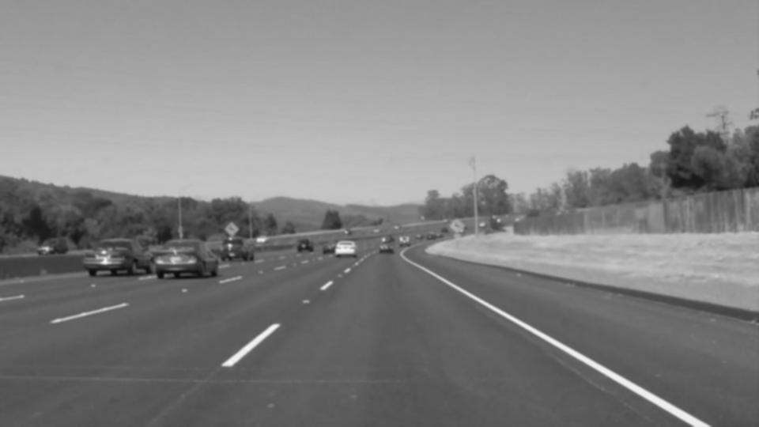
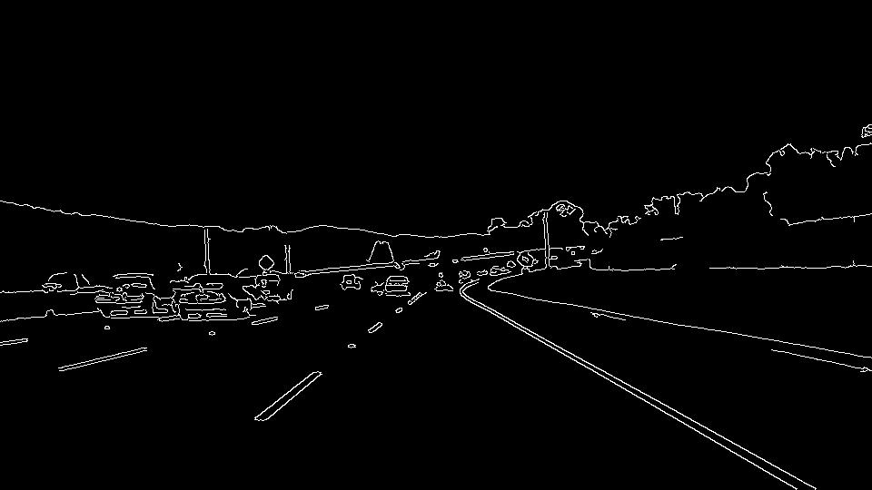
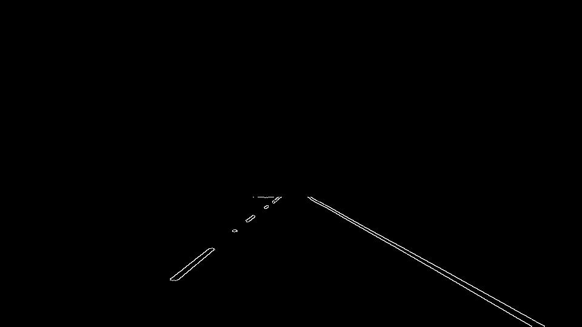
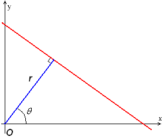
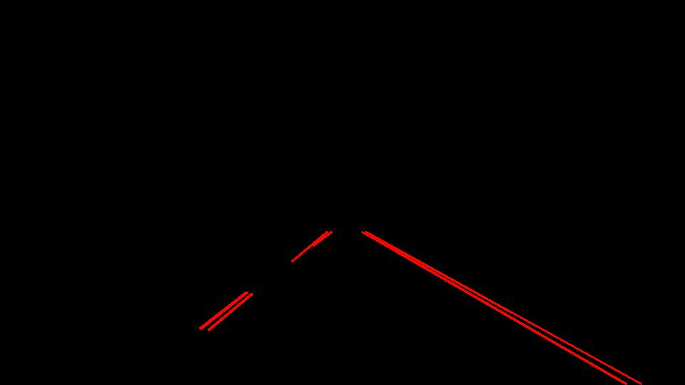
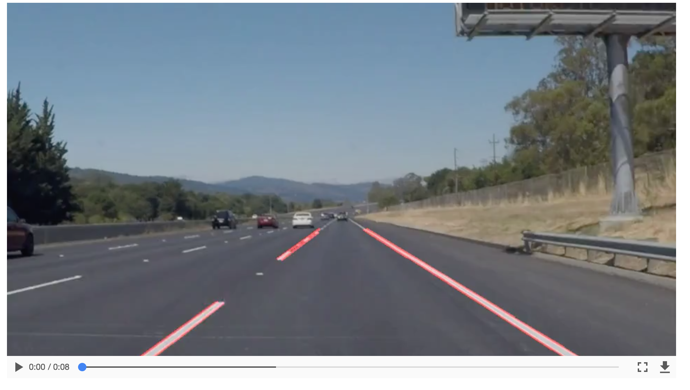
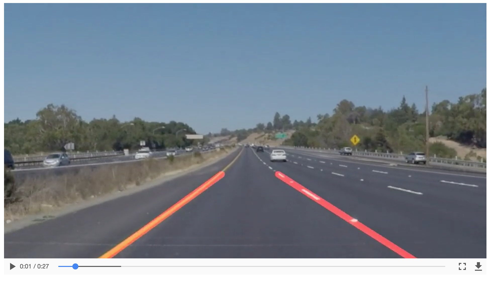
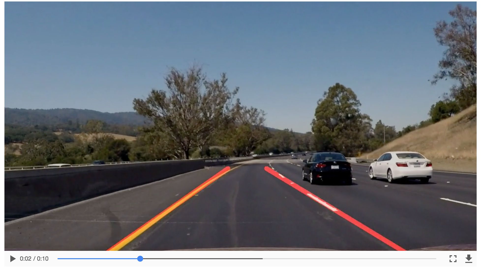

# **Finding Lane Lines on the Road** 
---

In this project, Python and OpenCV (Open-source Computer Vision) are used to develop an analytical 
pipeline that can be used to automate lane line detection in image and movie files.  This report
reflects some lessons learned.

## Building the vision pipeline

My initial pipeline consisted of gray scaling, Gaussian blurring, Canny edge detection, defining an appropriate
region of interest (regional mask), detecting line segments in region of interest that met specified constraints.

### Grayscaling
Yellow or white lane lines painted on dark asphault/pavement correspond with sharp 
transitions in pixel intensity, and thus are amenable to edge detection techniques.
Since such sharp transitions in pixel intensity are preserved in a grayscaled version 
of these types of image, color can be considered of secondary importance in this task, 
and may be discarded to simplify the procedure.


### Blurring
Blurring the grayscaled image (using OpenCV's `GaussianBlur`) allows us the reduce 
high-frequency/noisy aspects in an image.
This is an essential step since image noise can induce spurious edge detections.
Blurring helps disambiguate the overall directionality of edges in the image, providing an
a better chance at capturing only lower-frequency contours of 
ojbects in the field of view.  A tuning parameter here is the window/kernel size: how many neighboring 
pixels should be considered when computing the blurred value (i.e., weighted average) 
at a given pixel?  The tradeoff associated with kernel size is an edge detector's sensitivity 
to image noise and its ability to localize an edge properly. 
A [5x5 kernel](https://en.wikipedia.org/wiki/Canny_edge_detector#Gaussian_filter)
is considered safe and standard, though not necessarily the right choice for all applications.  




### Edge Detection
Using OpenCV's `Canny` function, [Canny edge detection](https://en.wikipedia.org/wiki/Canny_edge_detector) 
is then applied to the blurred image to capture the broadstroke edges of objects in the image. 
Two thresholding parameters can be tuned to restrict which pixels are considered to be a part of an
edge (see [documentation](http://docs.opencv.org/2.4/doc/tutorials/imgproc/imgtrans/canny_detector/canny_detector.html)).
If a pixel's gradient intensity exceeds the upper threshold, it is accepted as belonging to an edge.
If the intensity lies below the lower threshold, it is rejected.  Gradient intensities in the middle
range are accepted only if connected to a pixel exceeding the upper threshold.




### Regional Masking
At this point, we have an image with white edges sketched over a dark background.  
The question is: which edges are lane lines? This necessity to contextualize and properly interpret the edges is a major
step from image analysis into computer vision.  However, in our case, no black magic
(or deep learning) is (yet) necessary: contextualization can be provided by considering
the region in our images where the lane lines should appear.  Given the camera is mounted on the dashboard, 
this region should be roughly constant.




### Hough Line Segments
In a 2D Hough space, points represent lines through a 2D Euclidean space (or a slice of it, like in an image). 
Each line in a 2D Euclidean space can be represented by two pieces of information, `rho` and `theta`. 
* `rho` is the shortest distance of the line to origin, (0,0)
* `theta` is the angle of the line connecting those two points



One can use this mapping to help detect line segements in an image by simply counting votes
for each (rho, theta) pair on a Hough grid. 



### The Final Image
The final image is an overlay of the Hough line segments onto the original image.  
In the image below, we see an example of the output of this pipeline when applied to a 
movie file.  


The full video file can be found [here](./test_videos_output/solidWhiteRight.mp4).


## Refining the Pipeline: the Long-Line Overlay
The goal here was to overlay long, continuous lines on the lane lines,
independent of whether the lane lines were dashed or solid.  The `draw_lines()` function 
was modified in the following ways.


### Discerning Right from Left
Replacing the identified line segements in an image with two continous line segments representing
the left and right lanes first required developing a way to discern whether an edge was more likely
a piece of the left lane or the right lane.  
Given the image's (x,y) coordinate system, a useful observation is that the left lane edges should
have negative angles, while those making up the right lane line should possess positive
angles.

### Statistical Representatives
Once edges are separated into left and right groups, it is possible to estimate the slopes and 
intercepts that best represent the left and right lanes by taking group average.  

To stabilize the vertical presence of these representative lines throughout a sequence of images,
we can assert that the represenatives will consistently fill the full vertical extent of the 
trapezoidal region of interest from which the edges came.  

By plugging in our choice of vertical components and the estimates of slope and intercept, 
we can  compute the x coordinates of the left and right lines.  

```python
# Line Bottoms
left_ybot = shape[1]  
left_xbot = int((left_ybot - left_b)/ left_m)
right_ybot = shape[1]
right_xbot = int( (right_ybot - right_b)/right_m)
  
# Line Tops
right_xtop = int((y_top - right_b) / right_m)
left_xtop = int((y_top - left_b) / left_m)
```


### Angular Masking
More contextualization was necessary when applying this pipeline to the diversity of images 
represented in the movie files, especially in the optional challenge. 
For example, we do not necessarily want any edge identified with a positive slope
to contribute to the averages computed for the right line.  We only want the edges
with positive slope that are actually found along the right line.  Angular masking
helps us achieve this.

A quick glance at the images/movies suggests that an edge within the region of interest
must lie in the angular neighborhood of $45^{\circ}$ to be a line segment corresponding
to the right lane line.  Similarly, an edge must be in the neighborhood of $-45^{\circ}$
to be considered as a candidate edge for the left lane line.  I found $\alpha \pm \sim14^{\circ}$
worked well.




### Recent Memory
Once angular masking was put in place, there existed some frames in the movie files where no edges would be
identified as lying on a particular line, say the left line.  
This would give a NaN estimate for the slope and intercept, effectively causing the pipeline to
fail at detecting a lane line.  

Expanding the angular neighborhood too much
would forgo the control obtained by using an angular mask, so I sought an alternative approach.
It occurred to me that the lane line identification in the previous frame would very likely
be a good estimate for the current frame.  Given this would only be sparingly necessary,


### Generalizing to Other Image Sizes:  Percentages, not Pixels
The last thing I had to do to fully generalize the pipeline was to cast the coordinates
of trapezoidal regional mask in terms of their percentages along the full length and 
width of the image, instead of as pixel values.




### 2. Identify potential shortcomings with your current pipeline

In addition to angular masking, I could have probably used more robust statistics than the simple average.
For example, the median would likely be much more robust (and possibly obviate the need of angular masking,
though building in both is more robust, and more psychologically comforting).  

One potential shortcoming would be what would happen when ... 

Another shortcoming could be ...


### 3. Suggest possible improvements to your pipeline

A possible improvement would be to ...

Another potential improvement could be to ...
